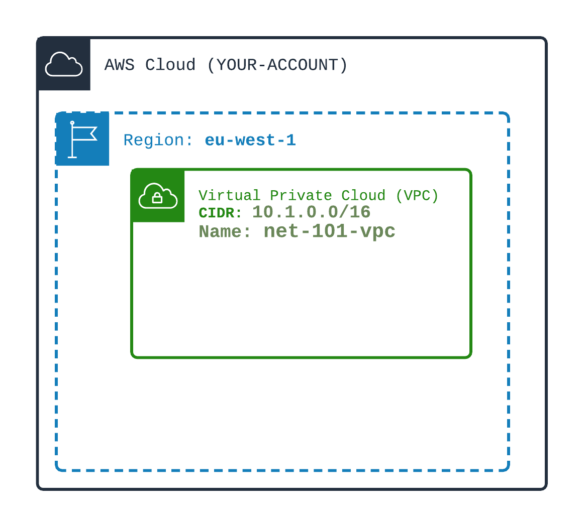

## Create a simple VPC (Virtual Private Cloud)

1️⃣ Create a simple VPC named **net-101-vpc**. 
The VPC must be able to support nearly 65536 private IP addresses.
The **size** of the VPC is choosen using the IPv4 CIDR parameter of the VPC (at creation).

🏁 Test the Created VPC using AWS CLI `aws ec2 describe-vpcs`


#### RFC 1918 Blocks of IP addresses
You can use https://www.ipaddressguide.com/cidr to see and compute blocks of Ips

```hcl
cidr_block = "10.0.0.0/16"  // You will get nearly 65536 IP private addresses all starting with 10.0.x.x

## Examples of RFC 1918 Blocks of IP addresses - Recommended
cidr_block = "10.1.0.0/16"  // You will get nearly 65536 IP private addresses all starting with 10.1.x.x
cidr_block = "10.1.2.0/24"  // You will get nearly 256 IP private addresses all starting with 10.1.2.x
cidr_block = "172.16.0.0/16"  // You will get nearly 65536 IP private addresses all starting with 172.16.x.x
cidr_block = "192.168.0.0/24"  // You will get nearly 256 IP private addresses all starting with 192.168.0.x
cidr_block = "192.168.0.0/28"  // You will get nearly 16 IP private addresses all starting with 192.168.0.x

## Non RFC 1918 Blocks of IP addresses - Not recommended
## Non RFC 1918 Ips are PUBLIC IPs and thus may be used by others and thus may conflict
cidr_block = "30.34.0.0/16"  // You will get nearly 65536 IP private addresses all starting with 30.34.x.x
```

#### AWS Reserve 5 IPs in VPC
If your VPC CIDR is 10.0.0.0/16 for example, AWS reserves following IP addresses:
- 10.0.0.0  (network address)
- 10.0.0.1  (router address)
- 10.0.0.2  (DNS address)  - very important
- 10.0.0.3  RESERVED
- 10.0.0.255  RESERVED

The real number of private IPs for a given CIDR is:
```
CIDR = a.b.c.d/N
Size = (2^(32-N))-5
Example: 10.0.0.0/24 -> 251 IP addresses
Example: 10.0.0.0/16 -> 65531 IP addresses
N must be within [16, 24]
```


NB: you can add additional IPv4 CIDR blocks afterward (up to 5 blocks of IPs).

[Doc AWS](https://docs.aws.amazon.com/vpc/latest/userguide/VPC_Subnets.html)



