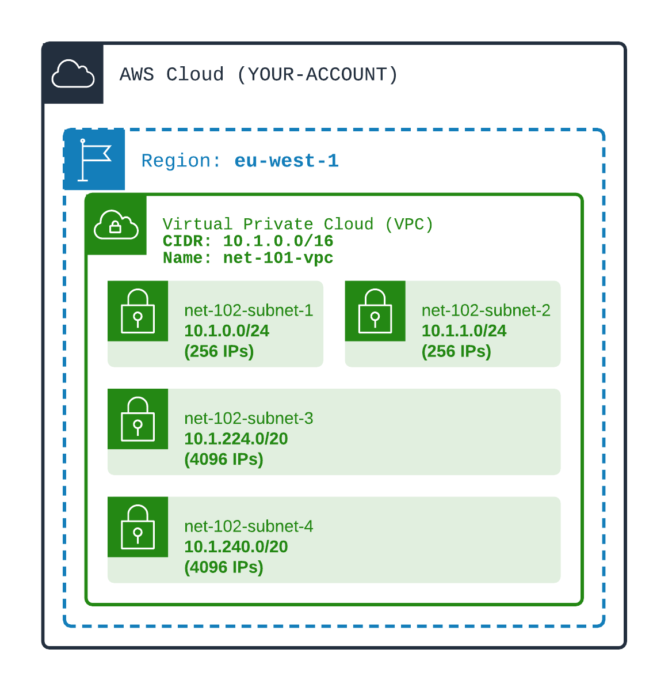

# Add four subnets in the VPC

## Your mission
1️⃣ Create four non-overlapping subnets: 
- net-102-subnet-1 with nearly 256 IPs in the first AZ in the region
- net-102-subnet-2 with nearly 256 IPs in the second AZ in the region
- net-102-subnet-3 with nearly **4096 IPs** in the first AZ in the region
- net-102-subnet-4 with nearly **4096 IPs** in the second AZ in the region

<div align="center">

</div>
<br>

#### Some additional help...
> For **Terraform workouts**, you can get AZ names using: ``data.aws_availability_zones.all.names`` array values

> For **CDK workouts**, you can get AZ names using: ``Stack.of(this).getAvailabilityZones();`` code

## Your success
🏁 Test the created Subnets using AWS CLI `aws ec2 describe-subnets`  
Reminder:
- You can use querying capabilities to see only some Subnets attributes. E.g: ``Subnets[].[SubnetId, CidrBlock, AvailabilityZone]``
- ✅ Display created Subnets for the VPC

You can use ``TEST-display-created-subnets.sh`` command to check your mission success
```shell
./launch.sh 1-networking/102-basic-subnets/TEST-display-created-subnets.sh 
```

## Materials
[Doc AWS](https://docs.aws.amazon.com/vpc/latest/userguide/VPC_Subnets.html)

You select the size of the subnet using the subnet IPv4 CIDR.

⚠️ A subnet belongs to **ONE** VPC.

⚠️ A subnet spans in ONE and ONLY ONE REGION (since it is in one VPC which itself is in ONE region)

⚠️ A subnet spans in ONE and ONLY ONE AVAILABILITY ZONE in the Region.

#### Private / Public subnets
**PUBLIC subnets** are subnets that have **routes** from and to internet. It is NOT a flag. It is the configuration of the network (route tables...) that make the subnet PUBLIC.

**PRIVATE subnets** are subnets WITHOUT **route** FROM internet. Private Subnets CAN have route TO internet. 

