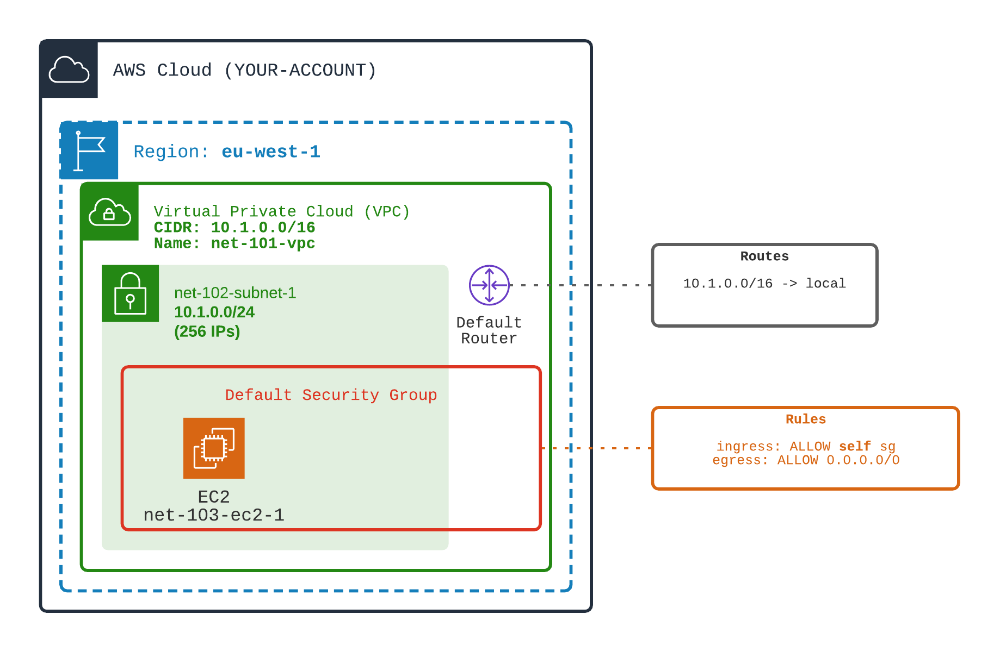

# Add an EC2 in subnet net-102-subnet-1

## Your mission
1️⃣ Create an EC2 in the subnet  
An **EC2** is a Virtual Machine i.e. a Compute resource.

When creating a brand new VPC, AWS provisions for you:
- a **default RouteTable** attached to the VPC. This default Route Table routes all traffic to any private IP addresses within VPC CIDR to the VPC (local loop)
- a **default Security Group** (firewall) attached to the VPC. This default Security Group allows any incoming (ingress) traffic from the VPC private IPs. This default Security Group allows any outgoing (egress) traffic.
- a **default Network ACL** (network level firewall) attached to the VPC. This default NACL allows any incoming traffic from the VPC IPs and any outgoing traffic. Subnets created in previous tutorial are associated to this NACL.

The aim of this tutorial is to see if we can connect to the created EC2 with these default network settings.

<div align="center">

</div>
<br>

#### Some additional help...
In order to create an EC2, you will have to provide (in Terraform or CDK files)
- the subnet you want the EC2 to be located in
- an AMI (OS image). Get the latest default basic Amazon Linux 2 AMI in your region
  > For **Terraform workouts**, you can rely on Terraform variable 
  > ```hcl 
  > data.aws_ami.amazon-linux.image_id``
  > ```

  > For **CDK workouts**, you can rely on following code to get it
  > ```java 
  > IMachineImage latestAMI = MachineImage.fromSsmParameter(EC2Helper.LINUX_LATEST_AMZN_2_AMI_HVM_X_86_64_GP_2, null);
  > ```

- an Instance Type `instance_type = "t2.micro"` (a tiny EC2)
- request a public IP : 
  - For Terraform tutorial, add `associate_public_ip_address = true` attribute
  - For CDK Tutorial, add a ElasticNetworkInterface with public IP to your EC2
    > ```java
    > .networkInterfaces(  // This is the way to add a public IP to the EC2 -> create a network interface (ENI)
    >     Collections.singletonList(
    >         CfnInstance.NetworkInterfaceProperty.builder()
    >                    .subnetId(subnet2.getAttrSubnetId())
    >                    .associatePublicIpAddress(true) // Request a public IP
    >                    .deviceIndex("0").build()))
    >```
- the SSH key named **aws-workout-key** (you've created in the prerequisites of the tutorial)

## Your success
🏁 Test the EC2 reachability
- ✅ Observe the default `Route Table` associated with VPC net-101-vpc (`aws ec2 describe-route-tables`)
  - The only route is a `local` route (from this VPC to this VPC)  
  - There is no route from internet

- ✅ Observe the default `Security Group`associated with VPC net-101-vpc (`ec2 describe-security-groups`)
  - The only Security Group Rule allows communication from this Security Group (itself)
  - There is no Security Group Rule that allows SSH (TCP port 22) or ping (ICMP)

- ✅ Observe the default `NACL`associated with VPC net-101-vpc (`ec2 describe-network-acls`)
  - The NACL allows incoming traffic from VPC only
  - The NACL allows any outgoing traffic

- ❌ Observe that with this setting it is not possible to SSH the created EC2

You can use following commands to check your mission success
```shell
./launch.sh 1-networking/103-vpc-default-route-default-sg/TEST-display-default-nacl.sh 
./launch.sh 1-networking/103-vpc-default-route-default-sg/TEST-display-default-route.sh 
./launch.sh 1-networking/103-vpc-default-route-default-sg/TEST-display-default-security-group.sh
./launch.sh 1-networking/103-vpc-default-route-default-sg/TEST-try-ssh.sh
```

## Materials

#### Network ALC
[NACLs](https://docs.aws.amazon.com/vpc/latest/userguide/vpc-network-acls.html) are network firewalls that ALLOW or DENY traffic from/to IPs. They are associated to Subnets. They apply to any instance launched within a subnet.
NACL are **stateless** firewalls: returned traffic MUST be authorized. See this [documentation](https://docs.aws.amazon.com/network-firewall/latest/developerguide/firewall-rules-engines.html).

#### Security Groups
[Security Groups](https://docs.aws.amazon.com/vpc/latest/userguide/VPC_SecurityGroups.html) are instance firewalls that ALLOW (no DENY possible) traffic from/to IPs. They are associated to Instances.
Security Groups are **stateful** firewalls. Returned traffic is authorized automatically if Request Traffic is authorized. See this [documentation](https://docs.aws.amazon.com/network-firewall/latest/developerguide/firewall-rules-engines.html).

#### Routes
[Routes](https://docs.aws.amazon.com/vpc/latest/userguide/vpc-network-acls.html) are routing definition associated with VPC 
See this [documentation](https://docs.aws.amazon.com/vpc/latest/userguide/VPC_Route_Tables.html).


