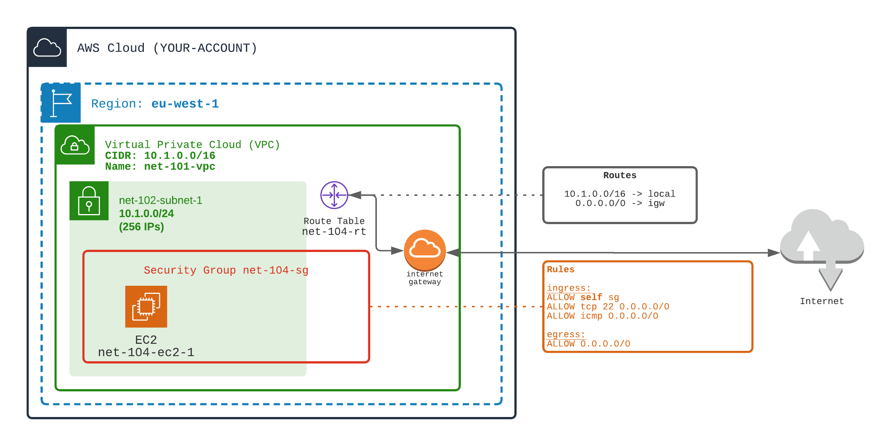

# Make EC2 reachable from internet
Make an EC2 reachable from anywhere (not a good practice from a security point of view, but this is a lab)

## Your mission
1️⃣ Add an `Internet Gateway` (net-104-igw) attached to the VPC (`net-101-vpc`)

2️⃣ Make the subnet reachable (route and security) from Internet through the Internet Gateway
- Create a Route Table `net-104-rt`
  - Add route rule to/from internet (0.0.0.0/0) in the Route Table. The route should go to InternetGateway (created just before)
  - Attach this route table to the subnet (`net-102-subnet-2`)
👉 Now the subnet is **PUBLIC** 

- Create a new Security Group `net-104-sg`
  - Add a SG rule, to the SG, to allow SSH port from internet (0.0.0.0/0)
  - Add a SG Rule, to the SG, to allow PING (icmp) port from internet

3️⃣ Start an EC2 within this subnet with this security group

<div align="center">

</div>
<br>

## Your success
🏁 Tests EC2 reachability
- Observe routes in the new Route Table (`aws ec2 describe-route-tables`)
- Observe security group rules in the new Security Group (`aws ec2 describe-security-groups`)
- Test PING using EC2's public IP (use `aws ec2 describe-instances`to get the EC2 public IP)
- Test SSH inside EC2 using public IP
- From withing EC2 (while ssh-in), try to reach internet (outgoing traffic)

You can use following commands to check your mission success
```shell
./launch.sh 1-networking/104-internet-access/TEST-display-route.sh 
./launch.sh 1-networking/104-internet-access/TEST-display-security-group.sh
./launch.sh 1-networking/104-internet-access/TEST-ping-ec2.sh
./launch.sh 1-networking/104-internet-access/TEST-ssh-in-ec2.sh
./launch.sh 1-networking/104-internet-access/TEST-reach-internet.sh
```

## Materials

[Doc AWS](https://docs.aws.amazon.com/vpc/latest/userguide/VPC_Internet_Gateway.html)
