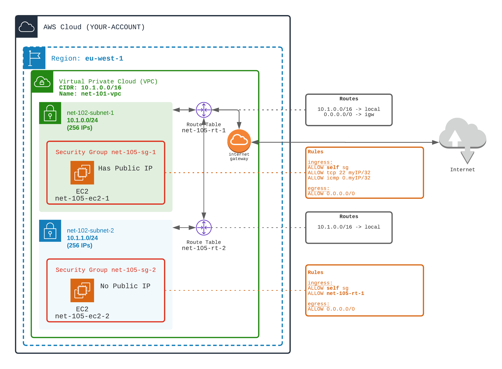

## Create a BASTION architecture

A Bastion (or Jump Box) is a network construct with:
- A public EC2 server (Bastion) that allows only SSH from your company IPs. The Bastion Server is in a PUBLCI subnet and has a public IP.
- Private EC2 servers deployed in private subnets. Private EC2s haven't public IPs
- The Bastion Server allows jumping to other private EC2s (SSH)

1️⃣ In a first subnet (public subnet `bastion`):
- create a route table routing traffic from/to internet through Internet Gateway
- create a security group allowing traffic for SSH and PING from your laptop (myIP/32)
- start an EC2 **WITH** a public IP inside this subnet

2️⃣ In a second subnet (private subnet)
- create a route table routing traffic from the VPC through local
- create a security group allowing traffic on any port ONLY from the previous security group (bastion)
- start a second EC2 **WITHOUT** public IP inside this subnet

🏁 Tests EC2s reachability
- ✅ Observe that you can SSH in the first EC2 from your laptop
- ❌ Observe that you CAN'T SSH in the first EC2 from another laptop (or from a VPN)  
- ✅ Observe that you can SSH in the second EC2 ONLY from the first EC2
- ❌ Observe that you can't SSH in the second EC2 from your laptop (anyway there is no public IP)
- ✅ Observe that you can reach internet from the first EC2
- ❌ Observe that you CAN'T reach internet from the second EC2

The fact that the private EC2 can't reach internet MAY BE a problem. For example for OS updates or packages updates.

