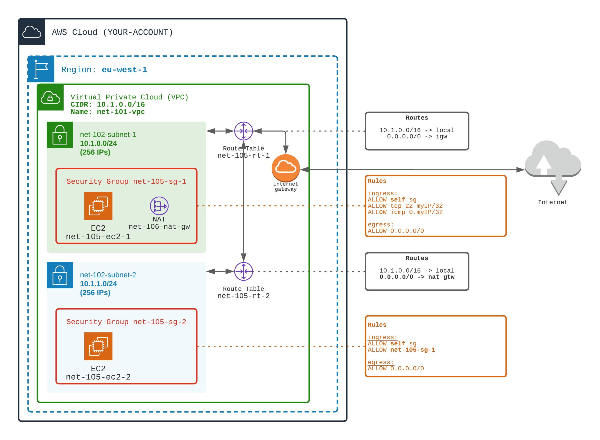
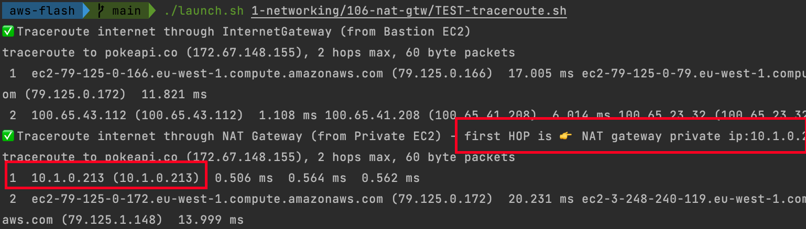

## Add an OUTGOING (egress) access to Internet from private subnets

⚠️ From the Bastion Workout, 
As we saw in `104 Bastion` workout, the private EC2s do not have Internet access. This may be an issue to upload OS updates or packages updates.

We are going to add a NAT gateway deployed in a public subnet to provide an OUTGOING access only to private EC2.

There are three types of NAT components:
- **NAT Gateway**: managed by AWS (no need to manage servers on your side). Usable for IP v4.
- **NAT Instances**: special EC2 (with particular AMI) managed by you, that provides NAT functions. Usable for IP v4.
- **egress only Internet Gateway**: managed by AWS. **Usable ONLY for IP v6**.

1️⃣ In the first subnet (public subnet)
- create an Elastic IP `net-106-nat-gtw-eip`
- create a NAT Gateway (with the attached Elastic IP) `net-106-nat-gtw`

2️⃣ In the second subnet (private subnet)
- in the route table, create a route to internet (0.0.0.0/0) through NAT Gateway (in the public subnet)

🏁 Test OUTGOING internet access from private EC2
- ✅ Observe that you can SSH in the first EC2 from your laptop
- ✅ Observe that you can SSH in the second EC2 ONLY from the first EC2
- ✅ Observe that you can reach internet from the first EC2
- ✅ Observe that you can reach internet from the second EC2
- ✅ Using Traceroute command, verify that outgoing traffic from first EC2 goes through Internet Gateway
- ✅ Using Traceroute command, verify that outgoing traffic from second EC2 goes through NAT Gateway. The first HOP in the route should be the NAT private IP

[Doc AWS](https://docs.aws.amazon.com/vpc/latest/userguide/vpc-nat.html)

