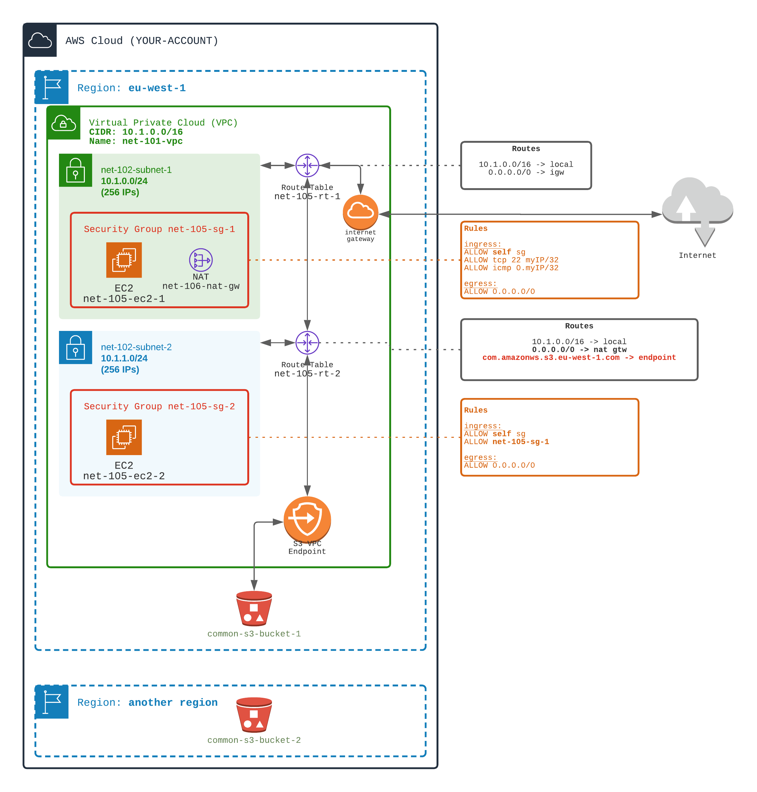

# Connecting S3 buckets through VPC endpoints and with NAT

## Your mission
⚠️ From the `NAT Gateway (106)` workouts

This tutorial is an extension of previous `107-vpc-endpoint`

0️⃣Tutorial creates for you two S3 buckets (so you can test S3 access)
  - one located in the first region (e.g: eu-west-1) `$UNIQUE_KEY-s3-bucket-1`
  - one located in the secondary region  (e.g: us-east-1) `$UNIQUE_KEY-s3-bucket-2`   

1️⃣ Add a VPC Endpoint for S3 (**Gateway** endpoint since the target service is S3)
  - Create a VPC Endpoint to S3 bucket in the first region
  - Modify the route table of the second subnet (``net-102-subnet-2``) to associate the VPC Endpoint

🏁 Test the routes to S3 buckets

- ✅ Observe the routes of the second subnet. 
  - Route table should contain an entry for S3 service `com.amazonws.eu-west-1.s3` in the same region. 
  - This route is automatically added when creating the gateway endpoint.
- ✅ On EC2 (ssh), use the `aws s3 ls --region=$TUTORIAL_REGION s3://$TUTORIAL_UNIQUE_KEY-s3-bucket-1` to see that S3 is accessible through VPC endpoint 
- ✅ On EC2 (ssh), use the `aws s3 ls --region=$TUTORIAL_ANOTHER_REGION  s3://$TUTORIAL_UNIQUE_KEY-s3-bucket-2` to see that S3 in second region is also accessible
  ✅ On EC2 (ssh), use the `traceroute` to see how the traffic is routed to S3 in both regions. 
  - It should go through VPC endpoint on S3 in first region, 
  - and through NAT on S3 in second region

## Support

[Doc AWS](https://docs.aws.amazon.com/vpc/latest/privatelink/vpc-endpoints.html)

