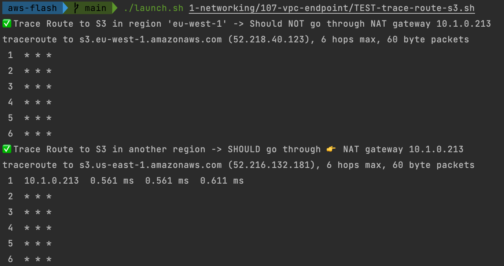

## Connecting S3 buckets through VPC endpoints

⚠️ From the Bastion DOJO (105) and (106)

Add a VPC Endpoint for S3 (Gateway endpoint)
- Create two S3 buckets:
  - one located in the same region (eu-west-1) `net-107-s3-bucket-1`
  - one located in another region `net-107-s3-bucket-2`   
- Create a VPC Endpoint to S3 bucket in the first region
- Modify the route table of the second subnet to associate the VPC Endpoint

- Observe the routes of the second subnet. 
  - Route table should contain an entry for S3 service `com.amazonws.eu-west-1.s3` in the same region
- Using Traceroute command, verify that outgoing traffic from second EC2 to the S3 in the same Region goes through the 👉 `VPC endpoint` (not internet)
- Using Traceroute command, verify that outgoing traffic from second EC2 to the S3 in the other region goes through the 👉 `NAT gateway (internet)`. 
  The first HOP in the route should be the NAT private IP
  

