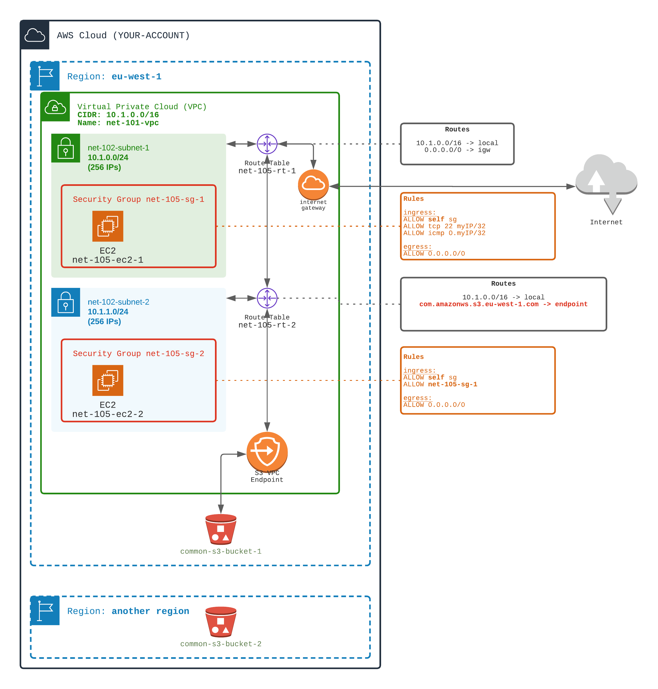

# Connecting S3 buckets through VPC endpoints

When you create an EC2, by default, the traffic to/from other AWS Services uses Internet.
E.g: if you create an S3 bucket, and accesses this bucket from the EC2 using AWS API or AWS CLI, the data will be routed using internet.  
E.g: if you use a DynamoDb table from an EC2, query and data traffic will be routed through internet.  
E.g: if you use a KMS keys from an EC2, kms data will be routed through internet.  
This may be security, a performance, a reliability issues.  
**You may want to restrict traffic to use only AWS backbone network.**

AWS provides **VPC Endpoints** to make the traffic flows on private AWS backbone network.
This way, for example, when using the S3 API from your EC2, the traffic stays in private AWS network and does not requires internet access.

There are two types of **VPC Endpoints**:
- **Gateway VPC Endpoints** for S3 and DynamoDB services ONLY. 
  - Behind the scene, these gateway endpoints relies on Route Tables and PrefixLists (a list of IPs managed by AWS)
- **Interface VPC Endpoints** for ALL OTHERS services. 
  - Behind the scene, these interface endpoints deal with Elastic Network Interface (ENI) and AWS PrivateLink
  - Interface VPC Endpoints can be used with your own services

(this difference is important for many certification questions 😉)

VPC endpoints are attached to a VPC and thus are **regional**.

## Your mission
⚠️ From the `Bastion (105)` workouts

0️⃣Tutorial creates for you two S3 buckets (so you can test S3 access)
  - one located in the first region (e.g: eu-west-1) `$UNIQUE_KEY-s3-bucket-1`
  - one located in the secondary region  (e.g: us-east-1) `$UNIQUE_KEY-s3-bucket-2`   

1️⃣ Add a VPC Endpoint for S3 (**Gateway** endpoint since the target service is S3)
  - Create a VPC Endpoint to S3 bucket in the first region
  - Modify the route table of the second subnet (``net-102-subnet-2``) to associate the VPC Endpoint

Remember that in `Bastion (105)` tutorial we saw that EC2 located inside private subnet ``net-102-subnet-2`` were not able to reach internet (and thus AWS services).
Nevertheless, having added a VPC endpoint for S3, EC2 is now able to reach S3 bucket (in the same region as the endpoint).

<div align="center">

</div>
<br>

## Your success
🏁 Test the routes to S3 buckets

- ✅ Observe the routes of the second subnet. 
  - Route table should contain an entry for S3 service `com.amazonws.eu-west-1.s3` in the same region. This route is automatically added when creating the gateway endpoint.
- ✅ On EC2 (ssh), use the `aws s3 ls --region=$TUTORIAL_REGION s3://$TUTORIAL_UNIQUE_KEY-s3-bucket-1` to see that S3 is accessible through VPC endpoint
- ❌ On EC2 (ssh), use the `aws s3 ls --region=$TUTORIAL_ANOTHER_REGION  s3://$TUTORIAL_UNIQUE_KEY-s3-bucket-2` to see that S3 in second region is NOT accessible

You can use following commands to check your mission success
```shell
./launch.sh 1-networking/107-vpc-endpoint/TEST-display-route.sh
./launch.sh 1-networking/107-vpc-endpoint/TEST-ssh-private-ec2.sh
./launch.sh 1-networking/107-vpc-endpoint/TEST-test-s3.sh
```


## Materials

[Doc AWS](https://docs.aws.amazon.com/vpc/latest/privatelink/vpc-endpoints.html)
