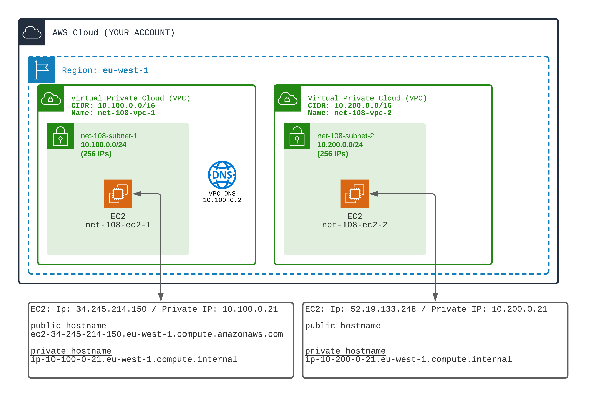
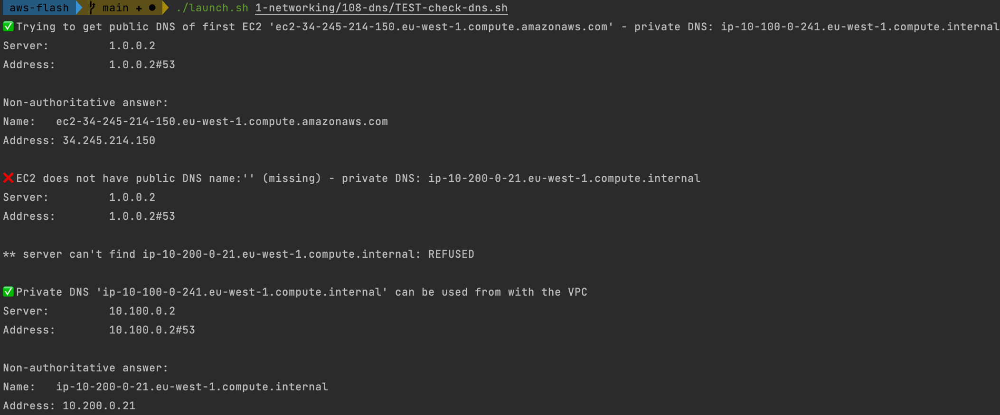

# VPC with or without DNS Support

## Your mission
AWS VPC come with AWS internal **DNS service**.
When creating a VPC you can enable or disable DNS service.

- You can enable/disable DNS resolution service.
- You can enable/disable DNS naming of your EC2s

Behind the scene, the DNS service is located at IP: `CIDR + 2`
Example: if your VPC CIDR is `10.0.0.0/24`. The DNS service will be at IP: `10.0.0.2`

1️⃣ Create Two VPC (with non overlapping CIDR)
- One VPC with DNS Support enabled
- One VPC without DNS Support

2️⃣ Launch one EC2 in each VPC

🏁 Observe the DNS names and resolution of EC2s
- ✅ The EC2 in the first VPC has a public and a private DNS name
- ✅ The EC2 in the second VPC has ONLY a private DNS name
- ✅ Using `nslookup` command, from your laptop, try to get the public IP from the public DNS name
- ❌ Using `nslookup` command, from your laptop try to get the private IP from the private DNS name
- ✅ Using `nslookup` command, from inside the first EC2, get the IP of the second EC2 using its private name. Resolve to the private IP.
- ✅ Using `nslookup` command, from inside the first EC2, get the IP of the second EC2 using its public name. Also resolve to the private IP.

## Support

[Doc AWS](https://docs.aws.amazon.com/vpc/latest/userguide/vpc-dns.html)

