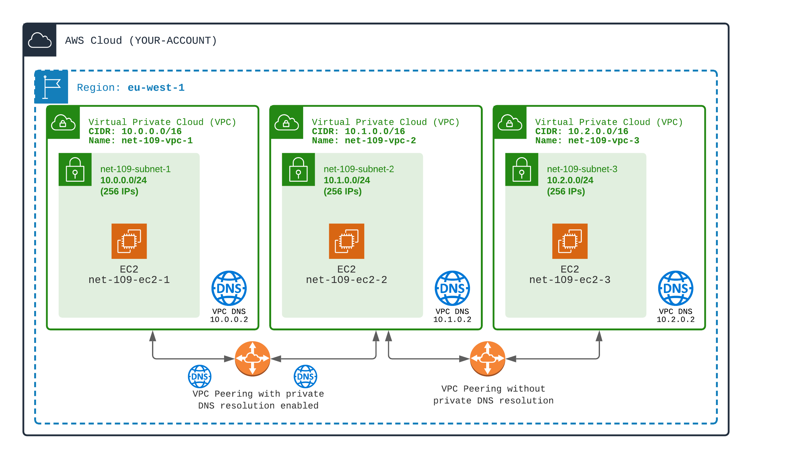
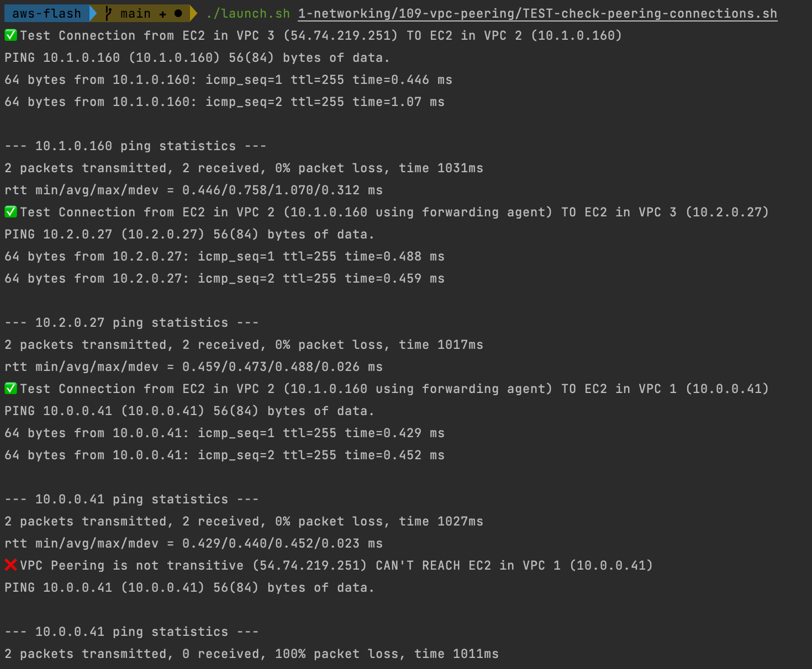
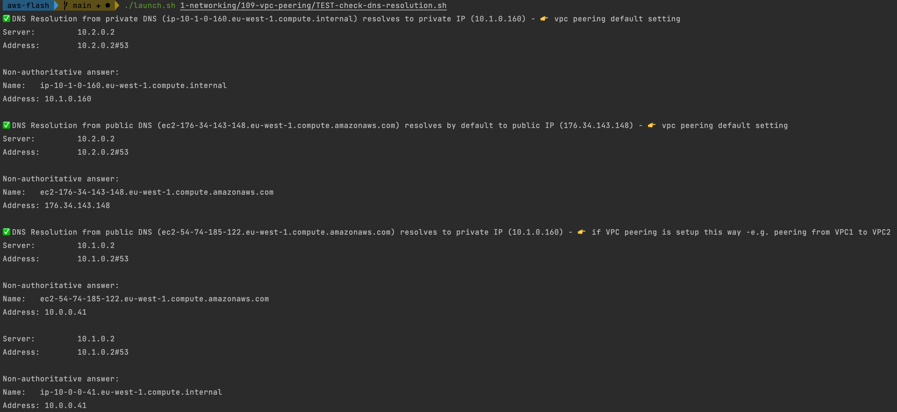

## VPC Peering

By default, **VPCs can't communicate to each others**.

VPC Peering is one way (among many others) to make VPC reachable from each others.

👉 VPC Peering is a one-to-one connection.
- There is NO transitivity. If A is peered to B, and B is peered to C, A CAN'T reach C.
- There is NO broadcast. There is no way to peer A with (B and C) using ONE VPC Peering connection.
 
If you need more complex VPCs connectivity you should have a look on **VPC Transit Gateway** (for example).

1️⃣ Create Three VPC with **non overlapping** CIDR
- All VPC with DNS enabled

2️⃣ Create an EC2, with public IP in all VPC, in default subnet and security group
- Add route to/from internet for VPC 3
- Allow SSH in SG for VPC 3

EC2 in VPC 3 will be accessible from internet (so you can SSH in and test connectivity from it).

3️⃣ Create VPC peering connections
- Add a VPC Peering connection, auto-approved, between VPC 3 and VPC 2
- Add a VPC Peering connection, auto-approved, between VPC 2 and VPC 1
- For this second VPC Peering Connection, enable private DNS resolution
- Update the route tables to route traffic from/to other VPCs through peering connection

⚠️⚠️ DNS Resolution options in VPC peering IS NOT AVAILABLE in CloudFormation. You will have to enable it either in AWS Console or through AWS CLI `aws ec2 modify-vpc-peering-connection-options` ⚠️⚠️

🏁 Test VPCs reachability from each others
- ✅ Observe that EC2 in VPC 2 is reachable from EC2 in VPC 1 using private IPs
- ✅ Observe that EC2 in VPC 1 is reachable from EC2 in VPC 2 using private IPs
- ✅ Observe that this connection is also possible in the other way
- ❌ Observe that EC2 in VPC 1 IS NOT reachable from VPC 3: VPC peering IS NOT transitive

For DNS resolution
- ✅ Observe that DNS `nslookup` of the **private host name** always resolve to **private IP**
- ✅ Observe that DNS `nslookup` of the **public host name** resolves to **public IP**
- ✅ Except for resolution of public DNS host names of VPC 1 from VPC 2, that resolves to private IPs

PEERING TESTS

DNS RESOLUTION TESTS

