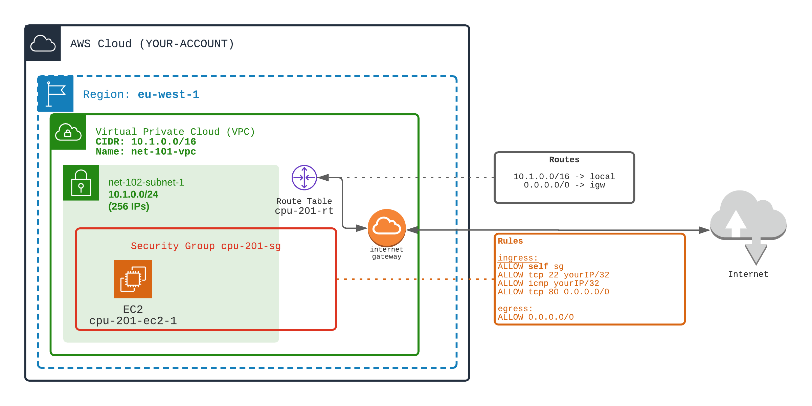

## A Simple EC2 

- Create a VPC, a subnet (or use `1-networking/101` and `1-networking/102` ones)
- Add an internet gateway and access to/from internet (see `1-networking/104`)
- Allow ports:
  - SSH only from your IP
  - ICMP only from your IP
  - HTTP from everywhere
    
Then test that you can SSH in the EC2.
Test that you can ping the EC2.
Test that you can ping (`netcat`) the port 80 of the EC2.
Test that the port 443 (or any others) is not opened

