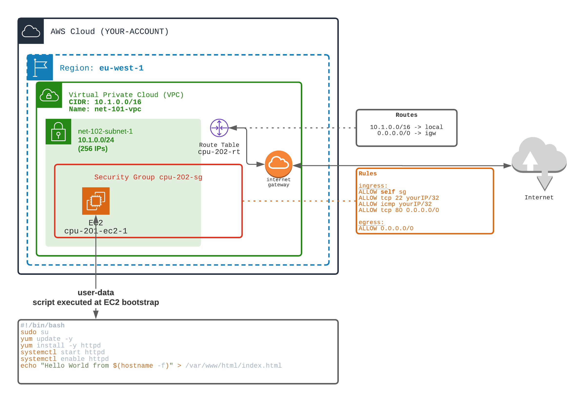

## A Simple EC2 with a User-Data Script

- Create a VPC, a subnet (or use `1-networking/101` and `1-networking/102` ones)
- Add an internet gateway and access to/from internet (see `1-networking/104`)
- Allow ports:
  - SSH only from your IP
  - ICMP only from your IP
  - HTTP from everywhere

👉 NEW !!! 👈
- In the EC2 definition, add a User-Data script.
The script will be executed **ONCE and ONLY ONCE** at EC2 bootstrap.
If you stop / restart the EC2, the script WILL NOT be relaunched.  
- In the script you can update the linux packages
- In the script you can install a service (e.g. apache httpd)

Once installed, the EC2 should be able to serve your html page.

