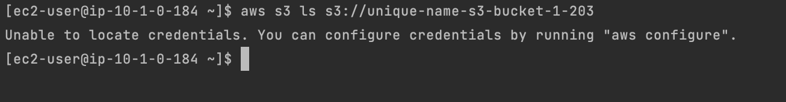

## Understand EC2 metadata service

EC2 launched in VPC can use a **Metadata service** provided by AWS.
This service allows the EC2 to get valuable information about **itself**.

The metadata service is an HTTP (80) service located at IP address `169.254.169.254`. (classical Cert question)

👉 For example an EC2 doesn't know its public IP address. Using `ifconfig` command (or equivalent command) will always provide the private IP.
To get the public IP, your need to query **metadata**.

👉  Another usage of **metadata service**, is to provide EC2 credentials to perform actions on your behalf.
You should NEVER store your own credentials in EC2.
EC2 relies on roles, and temporary credentials. These temporary credentials are provided automatically by **STS** service.
These temporary credentials are accessible through **metadata**.

## Your mission
1️⃣ Start and EC2
- Similarly to `2-computing/202` exercise, start an EC2 with user-data script to install a http server and serve html pages.
- In the html page, 👉 try to display the **public** IP v4.

In order to do so, you MUST rely on **Metadata Service** exposed by AWS:

From within the EC2 (inside the User-Data script for example):
```bash
curl 169.254.169.254/latest/meta-data/public-ipv4
```

`169.254.169.254/latest/meta-data` exposes some valuable information:
- public IPv4 of the EC2 (you can't find this information using linux `ifconfig` command. This command only exposes private IPs)
- public keys (ssh)
- metrics
- public-hostname
- secret STS Token
- ami...

2️⃣ Add a S3 bucket (with you own unique name)

3️⃣ Try to list S3 bucket content from within the EC2
❌ WITHOUT STORING YOUR CREDENTIALS IN THE EC2 ❌ Storing credentials directly in EC2 is a BAD habit.
We will see in `205 ec2 role` workout how to authorize EC2 to perform actions on our behalf.

<div align="center">

</div>
<br>

```bash
aws S3 ls s3://bucket-name
```

## Your success
🏁 Tests
- ✅ Test that the HTTP server started on the EC2 displays the PUBLIC IP
- ❌ Check that from the current EC2, it is NOT possible to access the S3 bucket

<div align="center">

</div>
<br>

You can use following commands to check your mission success
```shell
./launch.sh 2-computing/203-meta-data/TEST-curl.sh
./launch.sh 2-computing/203-meta-data/TEST-ssh-public-ec2.sh
./launch.sh 2-computing/203-meta-data/TEST-s3-access.sh
```

## Materials
[Doc AWS](https://docs.aws.amazon.com/AWSEC2/latest/UserGuide/ec2-instance-metadata.html)


