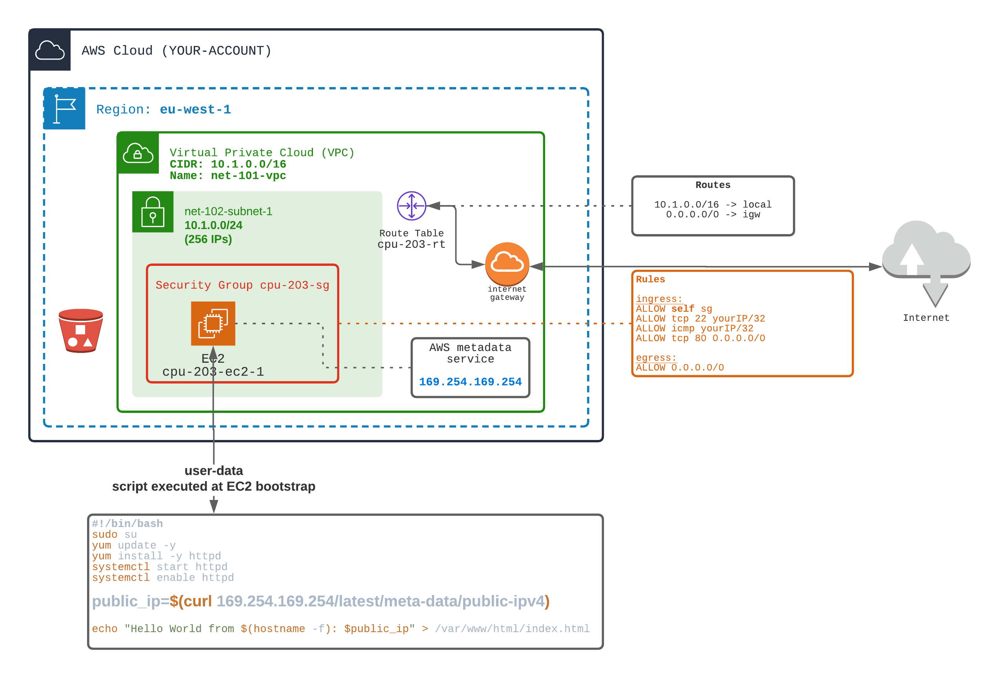

## Understand EC2 metadata service

1) Similarly to `2-computing/202` exercise, start an EC2 with user-data script to install a http server and serve html pages.
In the html page, 👉 try to display the public IP v4.

In order to do so, you can rely on 'MetaData Service' exposed by AWS:

From within the EC2 (inside the User-Data script for example):
```bash
curl 169.254.169.254/latest/meta-data/public-ipv4
```

`169.254.169.254/latest/meta-data` exposes some valuable information:
- public IPv4 of the EC2 (you can't find this information using linux `ifconfig` command. This command only exposes private IPs)
- public keys (ssh)
- metrics
- public-hostname
- ami...

2) Add a S3 bucket (with you own unique name)

3) Try to list S3 bucket content from within the EC2

❌ WITHOUT STORING YOUR CREDENTIALS IN THE EC2 ❌ Storing credentials directly in EC2 is a BAD habit.

```bash
aws S3 ls s3://bucket-name
```




