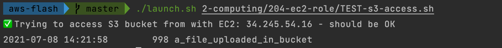
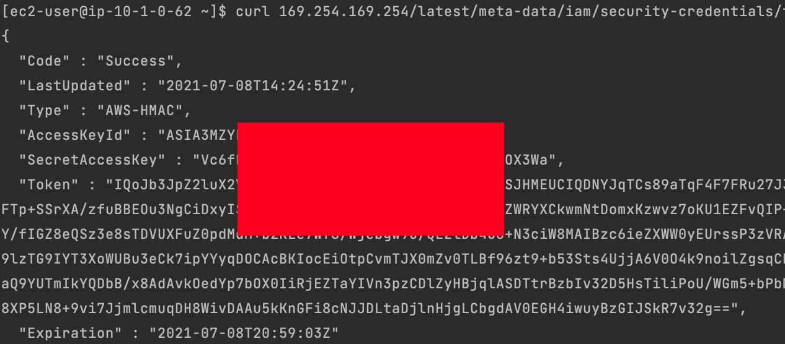
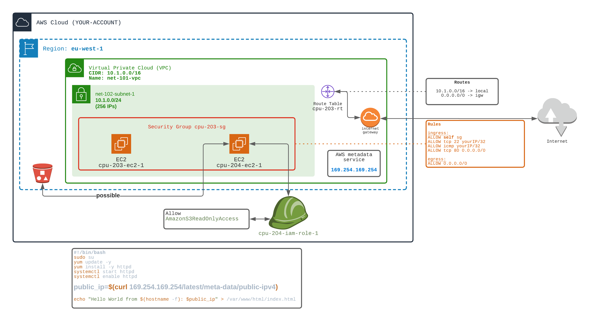

## Allow EC2 to perform actions on your behalf

👉 From the 203-meta-data exercise

1) Create an 👉 **IAM Role** named `cpu-204-iam-role-1`

2) Attach an 👉 ** IAM Policy ** allowing **S3 read only commands** to the previously created role. The policy already exists in the catalaog of predefined AWS policies. The name of the policy is `AmazonS3ReadOnlyAccess`

3) Attach the **Role** to a new EC2

You can see that now the EC2 can access S3 bucket content.

```bash
aws S3 ls s3://bucket-name
```



💀 Using the METADATA service you can now retrieve the temporary credentials (STS Token). 
THis may be dangerous. A user that can execute a CURL on the EC2 can retrieve STS token.

```bash
curl 169.254.169.254/latest/meta-data/iam/security-credentials/xxxx
```







