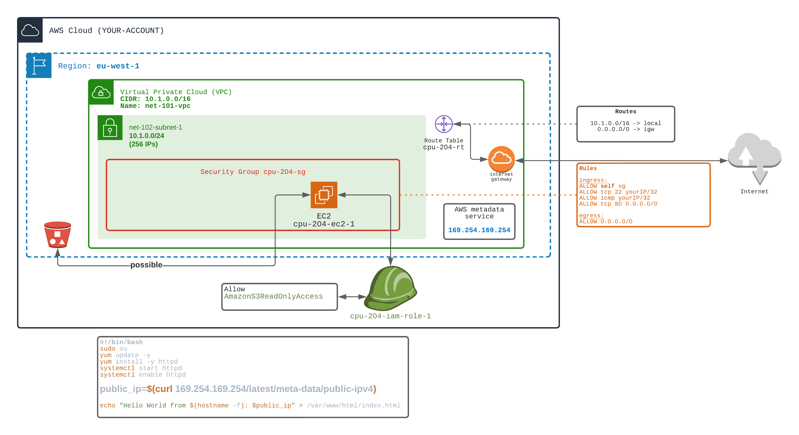

## Allow EC2 to perform actions on your behalf

As saw in the `203 metadata` workout, the EC2 launched is not able to connect to the S3 bucket.

By default, the EC2 launched have no right to execute any actions on your behalf. 
So, for example, the EC2 is not allowed to list the bucket content (even if the bucket allows the EC2 to do so).

In order to give actions rights to the EC2, we need to create **an IAM Role** that will be associated to the EC2.
The Role will be associated with **policies**. Policies describe what is possible to do.

There are two types of policies:
- AWS Managed ones (predefined classical policies)
- Inline ones (defined on your own)

👉 From the `203-meta-data` workout

1️⃣ Create an 👉 **IAM Role** named `cpu-204-iam-role-1`

2️⃣ Attach an AWS managed 👉 **IAM Policy** allowing **S3 read only commands** to the previously created role. 
The policy already exists in the catalog of predefined AWS policies. The name of the policy is `AmazonS3ReadOnlyAccess`

3️⃣ Attach the **Role** to a new EC2. In order to do so, you need to create an **Instance Profile** object linked to the IAM Role.
And then attached this Instance Profile to the EC2. EC2 can ONLY have ONE Instance Profile.

🏁 Test that the S3 is now reachable from the EC2
- ✅ You can see that now the EC2 can access S3 bucket content.

```bash
aws S3 ls s3://bucket-name
```

[Doc AWS](https://docs.aws.amazon.com/AWSEC2/latest/UserGuide/iam-roles-for-amazon-ec2.html)


### About STS Security

💀 Using the METADATA service you can now retrieve the temporary credentials (STS Token). 
THis may be dangerous. A user that can execute a CURL on the EC2 can retrieve STS token.

```bash
curl 169.254.169.254/latest/meta-data/iam/security-credentials/xxxx
```


If many users can access your EC2, you should restrict which user is allowed to access **metadata**.




