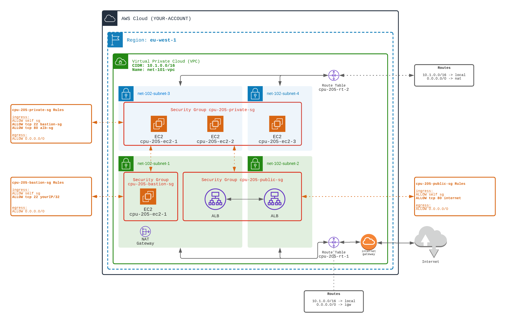

## ALB - Application Load Balancer

⭐⭐⭐ (more complexe)️ ⭐⭐⭐

Application Load Balancer is a component to balance the incoming traffic to many components (EC2s for example).
This way ALB spreads the traffic load over many content providers.

There are two types of ELB:
- **ALB**: Application Load Balancer (operates at OSI Level 7)
- **NLB**: Network Load Balancer (operated at OSI Level 3) - quicker than ALB (supports millions of requests)

https://aws.amazon.com/elasticloadbalancing/features/

ALB architecture is made of:
- Targets: where the traffic will be handled at the end (E.g. EC2, ECS...)
- Target Group: a group of targets
- Listener: a listener that redirect the traffic of a given protocol to a target group.

👉 From the 101-basic-vpc and 102-basic-subnets

You will have to combine many topics seen in previous exercises.

1️⃣ Create a BASTION architecture

- with 1 Bastion EC2 located in subnet `net-102-subnet-1`
- the Bastion EC2 must be launched within a Security Group `cpu-205-sg-2`
- the Bastion Security Group `cpu-205-sg-2` must allow incoming SSH from your laptop only
- the Bastion Security Group `cpu-205-sg-2` must allow outgoing traffic to everywhere

2️⃣ Create workers EC2 (three workers)

- the workers must be located in private subnets `net-102-subnet-3` and/or `net-102-subnet-4` (put 2 workers in one subnet, the remaining worker in the other subnet)
- the workers do no need public IPs (since they are in a private subnet)  
- each worker must start an HTTPD server like in tutorial `202`
- the workers must be launched within a Private Security Group `cpu-205-sg-3`
- the Private Security Group `cpu-205-sg-3` must allow incoming HTTP from the Public Security Group `cpu-205-sg-1`
- the Private Security Group `cpu-205-sg-3` must allow incoming SSH from the Bastion Security Group `cpu-205-sg-2`
- the Private Security Group `cpu-205-sg-3`  must allow outgoing traffic to everywhere

3️⃣ Install Internet Gateway for Internet access (in and out)

- the IGW must be accessible from the public and bastion subnets (`net-102-subnet-1` and `net-102-subnet-2`)
- you need to add a Route to `0.0.0.0/0` through Internet Gateway to a new Route Table `cpu-205-rt-1`
- associate the Route Table `cpu-205-rt-1` to `net-102-subnet-1` and `net-102-subnet-2` subnets

4️⃣ Install NAT Gateway for Internet access (out only) for Workers

Workers need to upload and install HTTPD yum packages. They need outgoing internet access.
   
- the NAT Gateway must be created in a public subnet (for example `net-102-subnet-1`)
- you need to add a Route to `0.0.0.0/0` through NAT Gateway to a new Route Table `cpu-205-rt-2`
- associate the Route Table `cpu-205-rt-2` to `net-102-subnet-3` and `net-102-subnet-4` private subnets

5️⃣ Create an Application Load Balancer (ALB)

- the ALB must be created in (at least two) public subnets (`net-102-subnet-1` and `net-102-subnet-2`) 
- the ALB must be launched within a public security group `cpu-205-sg-1`
- the public security group `cpu-205-sg-1` must allow incoming HTTP from everywhere
- the public security group `cpu-205-sg-1` must allow any outgoing traffic to everywhere
- create a **Target Group**
- attach the three EC2 workers as **Targets** to the Target Group
- add a **listener on port 80** on the ALB, that forward traffic to the Target Group

### Organise your files
You can split the TERRAFORM file, in multiple files in the same directory.
You can create:
- a `main.tf` file with the ALB
- a `network.tf` file with the subnets and routes/route tables
- a `security.tf` file with the security groups
- a `workers.tf` file with the EC2

🏁 Test that the ALB dispatchs the requests to the three workers
- ✅ When doing a CURL on the ALB's URL, the response comes from one of the workers (each time different)

[Doc AWS](https://docs.aws.amazon.com/elasticloadbalancing/latest/application/introduction.html)

