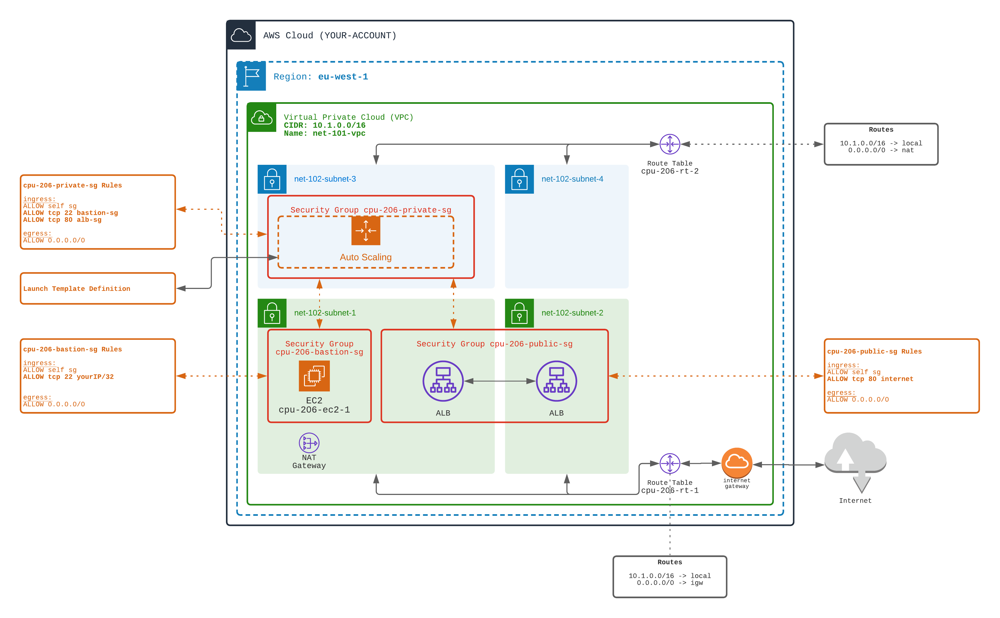

## ASG - Auto Scaling Group

⭐⭐⭐ (more complexe)️ ⭐⭐⭐

👉 From the 101-basic-vpc and 102-basic-subnets AND 206-alb

You will have to combine many topics seen in previous exercises.

Like in `Workout 205`, create a Bastion Architecture,
- with a public subnet / sg for ALB (HTTP from everywhere)
- with a limited subnet / sg for Bastion (SSH access from your IP only)
- with a private subnet / sg for workers (HTTP from ALB subnet, SSH from bastion subnet)

👉 BUT do not create manually the three EC2 workers !!!

Instead of a finite number of workers, 
- create a `launch template`, that describe how your EC2 will be created dynamically
- create an `Auto Scaling Group` (ASG) that reference the launch template`
- register the ASG inside the Application Load Balancer

