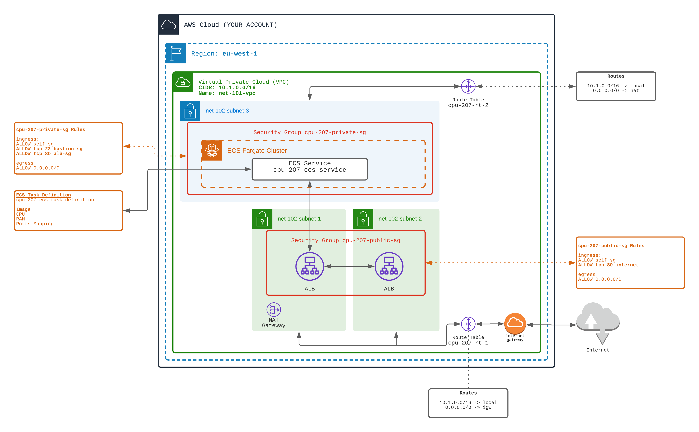

## ECS - FARGATE : Managed Cluster

⭐⭐⭐ (more complexe)️ ⭐⭐⭐

ECS is an AWS Service for Containers Clusters (Kub...)

The **ECS** Service let you provision Tasks and Services.
- **Tasks** are descriptions of the containers to be run
- **Services** are definitions of the desired instances count started from tasks

Services and Containers are run on an **ECS Cluster**.

There are two types of ECS Cluster:
- **EC2** based one. You provision the EC2s underlying the ECS cluster
- **FARGATE** based ECS Cluster; AWS provisions the workers underlying the ECS Cluster.

1️⃣ As in Workout `206 on auto-scaling`:
    - Create a public subnet, and a public security group
    - Create a private subnet, and a private security group
    - Add an Internet Gateway and a public route to internet, associated with the public subnet
    - Add a NAT Gateway (in the public subnet), and a route to internet. Associated it to the private subnet
    - Create an ALB and ALB Target Group 👉 BUT WITHOUT 👈 any target
  
  
2️⃣ Create an ECS Cluster. 
    - Select `FARGATE` container type. Fargate is a fully managed version of ECS. 
You will NOT have to create EC2 to support ECS cluster. 
  
3️⃣ Create an `ECS Task Definition`
  - The task Definition let you select:
      - the Docker Image (from DockerHub: the private subnet needs access to internet to download image), 
        For example, you can select ``httpd:2.4`` Apache image
      - the cpu size (256 means 1/4 V-CPU),
      - the Ram size (512 MB)
  - The networking mode of the Task will be 'awsvpc' (which means that the docker container share the VPC network)
    (see this [doc](https://docs.aws.amazon.com/AmazonECS/latest/developerguide/task-networking-awsvpc.html))

4️⃣ Create an `ECS Service`
  - The service describes how many PODs will be created
  - The service sets the minimum and maximum number of PODs instances
  - The service describes which Task to start (select the Task Definition)
  - 👉 The service must be linked to the ALB TargetGroup
  
🏁 Test that the ALB serves the HTTP page

[Doc AWS](https://docs.aws.amazon.com/AmazonECS/latest/developerguide/Welcome.html)

