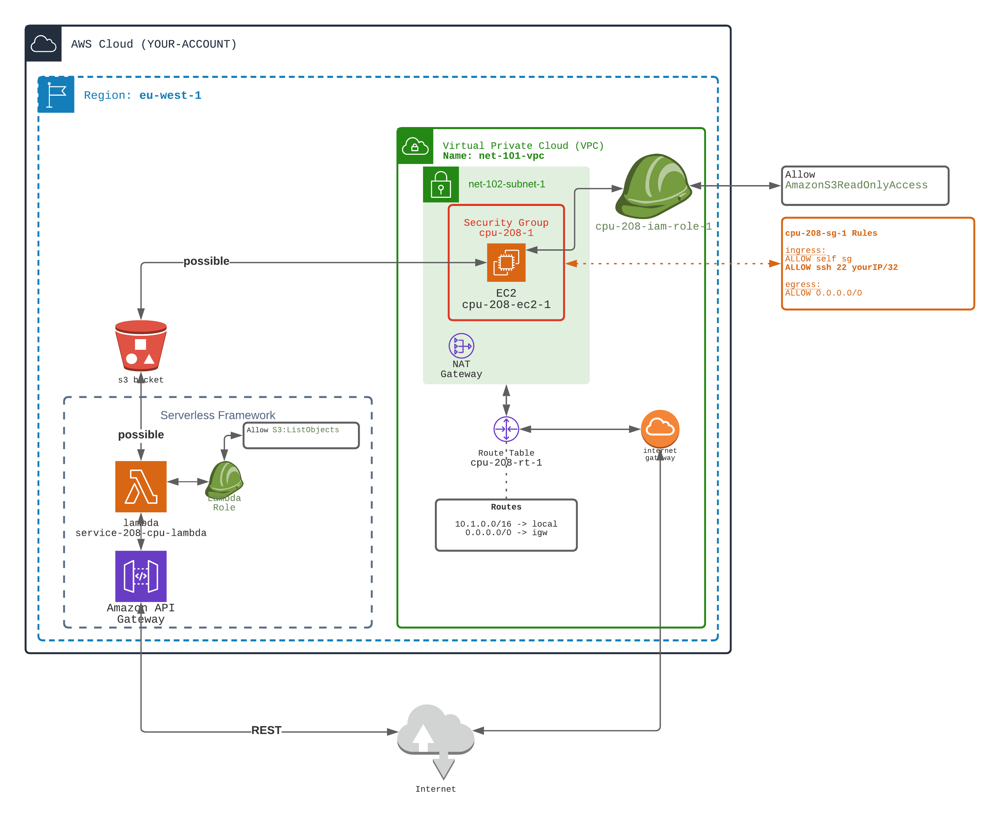

## Lambda using Serverless framework

⭐⭐⭐ (more complexe)️ ⭐⭐⭐

⚠️️ For this workout you will need to install **Serverless Framework**

It is possible to do this workout without serverless framework (using CloudFormation or Terraform).
Nevertheless, **Serveless Framework** eases the pain.

### Purpose
In this workout we are going to replace EC2 or ECS workers + ALB by Lambda functions + API Gateway.

The final architecture will be:
- A S3 bucket with an object inside
- A **lambda** function that enumerates the S3 bucket
- An API Gateway that exposes the Lambda function through REST API.
- A Bastion EC2 to be able to check the S3 (optional)

1️⃣ Install Serverless Framework globally on your laptop (you need npm)

```bash
npm install -g serverless
```  

2️⃣ Create a new Serverless Project in `208-sls-lambda/sls` directory

```bash
cd ./2-computing/208-sls-lambda
mkdir sls
cd sls
serverless create --template aws-nodejs-typescript
yarn
```

3️⃣ Create a S3 bucket, with an object inside
   

4️⃣ Create a public network (VPC, Subnet, Security Group)
    - allow SSH from your IP
    
5️⃣ Create an EC2 inside this network
    - allow the EC2 to perform S3:* actions on your behalf (see `204`)
    - you will be able to test S3 access from the EC2

6️⃣ Modify the SLS project
    - Modify the package.json to add dev dependency `aws-sdk`. Then do a `yarn` command.
    - Modify the lambda handler to list objects in the S3 bucket created (use `listObjectsV2` SDK method)
    - Authorize the lambda (in `serverless.ts` file) to perform S3 actions on the bucket. See: `iamRoleStatements`
    - Pass the name of the bucket using env variable (if possible)

7️⃣ Trigger SLS deploy / SLS remove from Terraform

```hcl
resource "null_resource" "deploy-sls" {
  provisioner "local-exec" {
    command = "(cd sls; yarn; BUCKET_NAME=${aws_s3_bucket.s3-bucket-1-208.bucket} yarn deploy)"
  }

  provisioner "local-exec" {
    when    = destroy
    command = "(cd sls; serverless remove)"
  }
}
```

🏁 That's it...
- ✅ Enumerate S3 objects from your laptop `aws s3 ls s3:\\bucketname`  (using your credential stored in profile)
- ✅ Enumerate S3 objects from the EC2 `aws s3 ls s3:\\bucketname` (using the EC2 role)
- ✅ Enumerate S3 objects using the exposed API (using the Lambda Role)




