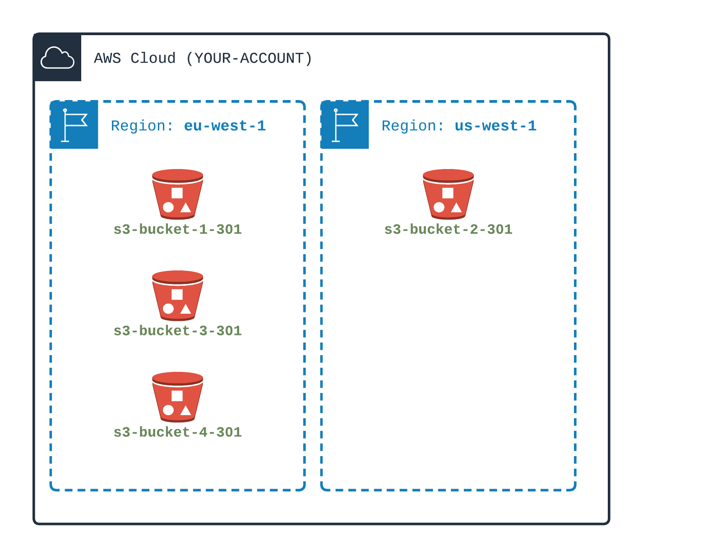

## Some S3 buckets

- S3 is an `object storage`
- Objects are stored in `Buckets`
- Buckets are created in a Region
- Objects are stored using a `Key`
- Keys can be a single string or a `path` like string
   
1) Create three S3 buckets in One region
2) Create a fourth S3 bucket in another region
3) Store objets in each buckets
4) Store objets in each buckets using path like string key

Then test that you can list buckets using AWS CLI
Test that you can list (ls) objects in one bucket
Test that you can store (copy) objects in one bucket

