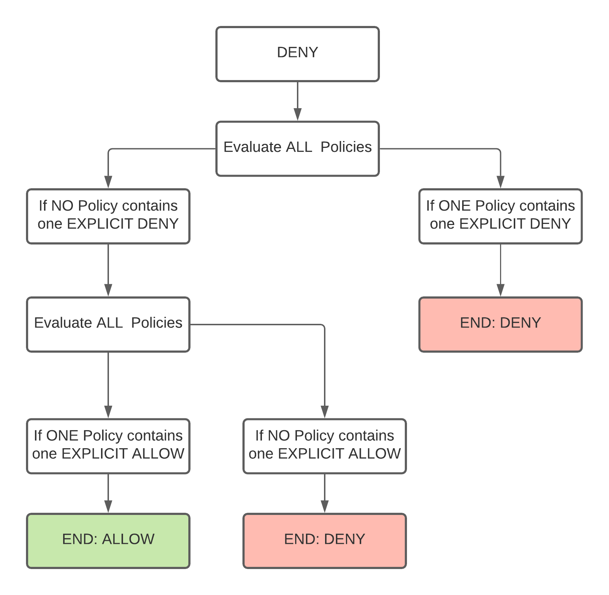

## Manage access to S3 using S3 bucket policies

- S3 bucket Policies are `Resource Policy` that allow or deny access to buckets or objects stored in buckets
- S3 bucket policies can ALLOW or DENY access for ``principal`` (principal can be a user, another AWS service, another AWS Account...)
- S3 bucket policies can DENY access or ALLOW access for a given IAM User (or Group) (from your account or from another account)
- S3 bucket policies can DENY or ALLOW access for a given public Ip (or a list of public IPs)
- S3 bucket policies can DENY or ALLOW access from a given VPC or `VPC S3 Gateway Endpoint` (associated to a VPC)

There are many more options on S3 bucket policies. See AWS documentation below.

0️⃣ Prerequisite: 
- Create two EC2 within a VPC, both with public IPs and internet access (see `107` networking workout)
- Add a VPC Endpoint associated to S3 region eu-west-1 (see `107` networking workout)
- Attach a role to the EC2s (see `204` computing workout) that allows S3 read actions (allow the EC2 to assume the role)
- The role must allow S3 ReadOnly commands.

**With these steps, created EC2s will be able to work with S3 (emit S3 commands on your behalf).**

1️⃣ Add a **bucket policy** to bucket 1, that allow `GetObject` action **from a given user only**
   
It is easier and safer to `DENY` `GetObject` action for all other users and `ALLOW` all other commands for everybody. (for demo purpose only)

Example:
```
    Statement = [
      {
        Sid       = "AllowGetObjectFromOneUserOnly"
        Effect    = "Deny"
        Principal = "*"
        Action    = "s3:GetObject"
        Resource = [
          "THE_BUCKET_ARN/*",
        ]
        Condition = {
          "StringNotLike": {
            "aws:userId": [
              "A_USER_ID"
            ]
          }
        }
      },
      {
        Sid       = "AllFromEveryBody"
        Effect    = "Allow"
        Principal = "*"         // everybody
        Action    = "s3:*"      // any S3 action
        Resource = [
          "THE_BUCKET_ARN",
          "THE_BUCKET_ARN/*",
        ]
      },
    ]

```

An explicit DENY is always **stronger** than any other statement 



2️⃣ Add a bucket policy to bucket 2, that allow `GetObject` action only from **an EC2 instance IP or from your laptop IP**

It is easier and safer to `DENY` `GetObject` action for all other IPs and `ALLOW` all other commands for everybody. (for demo purpose only)

Example:
```
    Statement = [
      {
        Sid       = "AllowGetObjectFromSomeIPsOnly"
        Effect    = "Deny"
        Principal = "*"
        Action    = "s3:GetObject"
        Resource = [
          "THE_BUCKET_ARN/*",
        ]
        Condition = {
          NotIpAddress = {
            "aws:SourceIp" = [
              "YOUR_IP_ADRESS/32",
              "THE_EC2_IP_ADRESS/32"]
          }
        }
      },
      {
        Sid       = "AllowAllOtherActionsFromEveryWhere"
        Effect    = "Allow"
        Principal = "*"
        Action    = "s3:*"
        Resource = [
          "THE_BUCKET_ARN",
          "THE_BUCKET_ARN/*",
        ]
      },
    ]
```

4️⃣ Add a bucket policy to bucket 3, that allow `GetObject` action only from a VPC Endpoint

It is easier and safer to `DENY` `GetObject` action for all other sources (not VPC Endpoint) and `ALLOW` all other commands for everybody. (for demo purpose only)

Example:
```
   Statement = [
      {
        Sid       = "AllowGetObjectFromVpcEndpointOnly"
        Effect    = "Deny"
        Principal = "*"
        Action    = "s3:GetObject"
        Resource = [
          "THE_BUCKET_ARN/*",
        ]
        Condition = {
            "StringNotEquals": {
              "aws:SourceVpce": THE_VPCE_ID
            }
        }
      },
      {
        Sid       = "AllFromEveryBody"
        Effect    = "Allow"
        Principal = "*"
        Action    = "s3:*"
        Resource = [
          "THE_BUCKET_ARN",
          "THE_BUCKET_ARN/*",
        ]
      },
    ]

```

5️⃣ Create another IAM User and CLI profile for another user `aws-workout-other-user` (you will need it for test purpose)

🏁 Test S3 access

**Bucket 1 with Bucket Policy based on IAM users**
- ✅ Then test that you can `GetObject` in bucket 1 using your `aws-workout` profile (User1)
- ❌ Then test that you can't `GetObject` in bucket 1 using the second profile

**Bucket 2 with Bucket Policy based on IP addresses**
- ✅ Then test that you can `GetObject` in bucket 2 using your laptop (your IP)
- ✅ Then test that you can `GetObjeect` in bucket 2 using one EC2
- ❌ Then test that you can't `GetObject` in bucket 2 using the second EC2

**Bucket 3 with Bucket Policy based on VPC Endpoint access**
- ✅ Then test that you can `GetObject` in bucket 3 using the EC2 (inside VPC) (through VPC Endpoint)
- ❌ Then test that you can't `GetObject` in bucket 3 using your laptop


[Doc AWS](https://docs.aws.amazon.com/AmazonS3/latest/userguide/example-bucket-policies.html)
