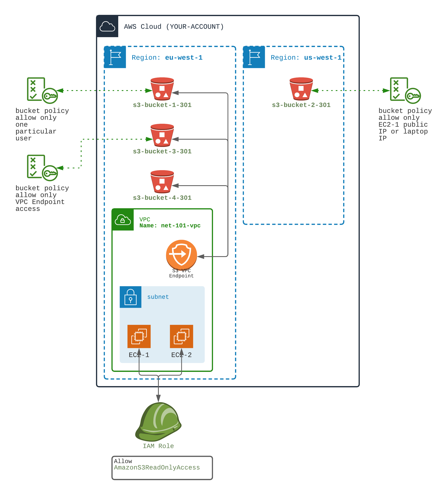

## Manage access to S3 using S3 bucket policies

- S3 bucket Policies are `Resource Policy` that allow or deny access to buckets or objects stored in buckets
- S3 bucket policies can ALLOW or DENY access for ``principal`` (principal can be a user, another AWS service, another AWS Account...)
- S3 bucket policies can DENY access or ALLOW access for a given IAM User (or Group) (from your account or from another account)
- S3 bucket policies can DENY or ALLOW access for a given public Ip (or a list of public IPs)
- S3 bucket policies can DENY or ALLOW access from a given VPC or `VPC S3 Gateway Endpoint` (associated to a VPC)

There are many more options on S3 bucket policies. See AWS documentation below.

0️⃣ Create:
- two EC2 within a VPC, both with public IPs and internet access (see `107` networking workouts)
- with a VPC Endpoint associated to S3 region eu-west-1 (see `107` networking workout)
- Attach a role to the EC2s (see `204` computing workout)
- The role must allow S3 ReadOnly commands.

**With these steps, created EC2s will be able to work with S3 (emit S3 commands on your behalf).**

1️⃣ Add a **bucket policy** to bucket 1, that allow `GetObject` command access **from a given user only**
   
In fact, it is easier and safer to `DENY` `GetObject` command for all other users.
Allow all other commands for everybody. (for demo purpose only)

2️⃣ Add a bucket policy to bucket 2, that allow `GetObject` command access only from **a EC2 instance IP or from your laptop IP**

In fact, it is easier and safer to `DENY` `GetObject` command for all other IPs.
Allow all other commands for everybody. (for demo purpose only)

4️⃣ Add a bucket policy to bucket 3, that allow `GetObject` command access only from a VPC Endpoint

In fact, it is easier and safer to `DENY` `GetObject` command if source IS NOT VPCE
Allow all other commands for everybody. (for demo purpose only)

5️⃣ Create another IAM User and CLI profile for another user `aws-workout-other-user`

🏁 Test S3 access

Bucket 1 with Bucket Policy based on IAM users
- ✅ Then test that you can `GetObject` in bucket 1 using your `aws-workout` profile (User1)
- ❌ Then test that you can't `GetObject` in bucket 1 using the second profile

Bucket 2 with Bucket Policy based on IPs
- ✅ Then test that you can `GetObject` in bucket 2 using your laptop (your IP)
- ✅ Then test that you can `GetObjeect` in bucket 2 using one EC2
- ❌ Then test that you can't `GetObject` in bucket 2 using the second EC2

Bucket 3 with Bucket Policy based on VPC Endpoint access
- ✅ Then test that you can `GetObject` in bucket 3 using the EC2 (inside VPC) (through VPC Endpoint)
- ❌ Then test that you can't `GetObject` in bucket 3 using your laptop

[Doc AWS](https://docs.aws.amazon.com/AmazonS3/latest/userguide/example-bucket-policies.html)
